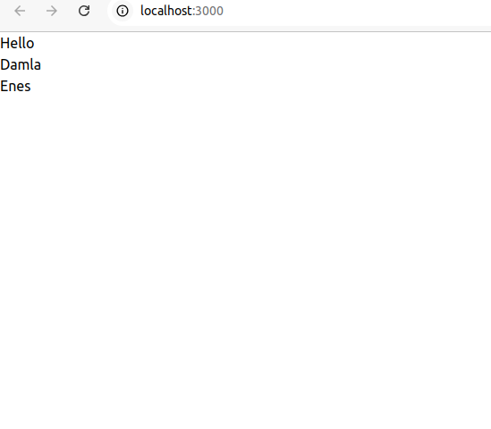
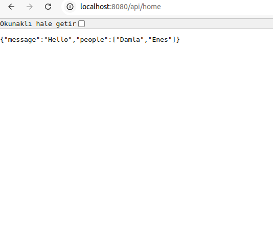

# Project Name

This project is built with a **client** (frontend) and a **server** (backend) architecture, designed for modern web application development. A simple connection between **Node.js** and **Next.js** has been established, where the `/api/home` endpoint is fetched from the client side.

---
## Screenshots

### Client


### Server


## Client

The **client** component is built using modern technologies like **React**, **Next.js**, and **TailwindCSS**.

### Features
- **React 19 (Beta)** for cutting-edge UI development.
- **Next.js 15** for server-side rendering (SSR) and static site generation (SSG).
- **TailwindCSS** for fast and easy styling.
- TypeScript support for type safety.
- Fetches data from the **Node.js** API, such as the `/api/home` endpoint.

### API Usage
On the client side, data is fetched from the `/api/home` endpoint provided by the server. This simple integration demonstrates communication between the client and server.

### Scripts
- `npm run dev`: Starts the development server.
- `npm run build`: Builds the application for production.
- `npm run start`: Runs the built application.
- `npm run lint`: Checks code quality.

### Requirements
- **Node.js** and **npm** must be installed.

---

## Server

The **server** component is built with **Express.js** to provide API endpoints and handle communication with the client.

### Features
- Lightweight and fast server using **Express.js**.
- **CORS** support for secure client-server communication.
- Automatic server restarts during development with **nodemon**.
- `/api/home` endpoint serves data to the client.

### API Endpoints
- **GET /api/home**: Provides basic data to the client. Example JSON response:
  ```json
  {
    "message": "Welcome! This message is served from the server."
  }
